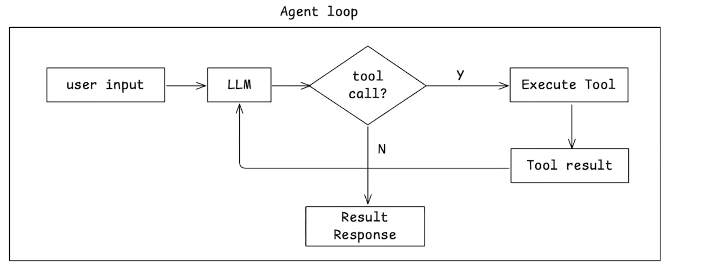

# agent

 ## design doc 中文逆向还原
查找网上 js decypher /unuglify 或者处理js ast 的工具，想办法把 /vendors/claude 里面的核心要素还原出来。
撰写一个design doc 放在./specs 下。等我review,design doc 用中文表达

 ## opencode 源码分析，需要下载代码到本地

### 1 
查看 ./vendors/opencode 源码，帮我了解如何最方便地获得 opencode 每次向 llm 发送的包含完整内容的输入输出，最好是有 hook / plugin 什么的，避免我直接修改源码。
先不要撰写，告诉我方案（先告诉我你的计划，先不要操作）

### 2  prompt一个工具使用外挂机制拦截系统交互，进一步分析系统行为，输出结果是log 日志
使用方案1，注意一次完整的对话（用户输入，agent多轮工具调用，最后得到完整结果）的内容放在同一个jsonl里，新的内容append进去，不同的对话使用不同的jsonl。
请捕获每个turn的到llm的完整输入，和完整输出。脚本放在./plugins/log-conversation.ts中。确保代码的正确性，然后部署。输出内容放在./logs下。

### 3 目的：缺少一个 log 分析工具，就现场 prompt 一个，来分析log日志文件
读取当前 ./logs 下的文件，每行都是一个 json，分析其 schema，帮我构建一个前端可视化 app，用户打开一个 jsonl 文件，
你可以将其很好地分门别类在一个页面中展示不同 turn 下的输出输出，注意使用 scrollbar 来控制区域长度，文字内容使用 markdown renderer 来渲染。
design token 使用 ./visualizer/styles/design-token.css，global css 使用 ./visualizer/styles/global.css。
构建一个 react app，放在 visualizer 下。根据这些需求，先撰写一个 design doc 放在 ./specs 下，然后完整实现。

！<如果 design-tokens.css 拼错了找不到文件，大模型会自动编一套，当然我们也可以告诉他假如文件没有让他停止操作而不是自己编一个>

## simple agent 构建:  重要的是 spec 怎么构建出来！！！，花时间想好这个 spec 要怎么描述：核心的交互流程，数据结构，关键规则 等等！

### 方式一：prompt 一个实现文档(../specs/w6/0002-simple-agent-design-backup.md)

帮我构建一个实验性质的简单但完整的 Simple Agent,它可以完成多步的 agent loop,如图。think ultra hard 构建一个 typescript 的 design 放在 ./agent-design.md,使用中文输出

### 方式二：参考 opencode prompt 出来的文档
* 通过研究 opencode 反向得出了一个设计文档，在根据设计文档实现出自定义的 agent

### 实现 agent
基于 @specs/w6/0001-simple-agent-design.md 的规范，使用 openai 构建一个 agent sdk，提供 agent 的核心功能，用户可以很方便地为 agent 添加自定义工具和 mcp。完成构建后，确保所有实现否符合 design spec，并提供几个 example 来展示如何使用（包含至少一个使用 mcp 的例子）。

### 补充
* 确保全部依赖使用最新版本
* 确保开发时使用最佳实践，这个生成后可以去其他模型验证！prompt → generation → review → confirm，go next！

## 构建 codereview agent design spec

###  system prompt：（openai 接口不一定通，需要换成其他的模型）
based on @specs/w6/prompts/codex.txt and @specs/w6/prompts/reviewer.txt think hard, we want to generate a system prompt for ./w6/codereview-agent which is based on @w6/simple-agent/. The codereview agent will only have read file / write file / git command tool so make sure system prompt don't mention unexisting stuff. And make sure system prompt focused on code review but have all the good parts of @specs/w6/prompts/codex.txt. Write the prompts down to ./w6/codereview-agent/prompts/system.md. Think ultra hard.

* 需要检查 system.md 文件，确认其中的 system prompt 是否已明确、全面地定义了与代码审查（code review）流程相关的所有行为规范。

### 实现
根据 ./w6/codereview-agent/prompts/system.md 文档，以及 ./w6/simple-agent 代码，构建一个 codereview agent。它包含这些工具：

read file：读取当前目录下某个文件的内容
write file：写入当前目录下某个文件的内容
git command：执行 git 命令，尤其是可以根据用户的各种需求，找到合适的 git diff，包括不限于：branch diff, unstaged diff, staged diff, commit diff, pull request diff, 等等
gh command：执行 gh 命令，尤其是可以根据用户的各种需求，找到合适的 gh 命令，包括不限于：pr view, pr diff, 等等
这些工具的使用方法，相关的例子要更新在 system.md 中，这样 LLM 可以很方便地使用这些工具。

用户可以这样使用 codereview agent：

帮我 review 当前 branch 新代码
帮我 review commit 13bad5 之后的代码
帮我 review pull request 12 的代码
仔细考虑这些需求，构建一个 solid 的设计文档，文档放在 ./specs/w6/0003-codereview-agent-design.md 文件中。design doc 输出中文。

## 构建 codereview agent 代码
根据 ./specs/w6/0003-codereview-agent-design.md 文档，构建一个 codereview agent 的代码（使用 ./w6/simple-agent 作为 dependency），代码放在 ./w6/codereview-agent 目录下。代码要完整实现 design spec，符合其要求。实现完成后请根据几个场景运行测试，确保它正常工作。

* system prompt 应该要注意当前路径，如果有命令失败，应该分析并找到正确的命令。agent loop 应该要把错误的工具调用结果也添加到 chat history（查看 simple_agent 是否做了）

## codex review
使用 codex review skill 对 ./w6/codereview-agent 代码进行 review，确保代码符合 ./specs/w6/0003-codereview-agent-design.md 的设计。将 rewiew 结果写在 ./specs/w6/0004-codereview-agent-codex-review.md 文件中。

## 问题？
* 是能独立运行的 agent，在命令行即可运行 npm run xxx