# ScribeFlow 系统详细设计文档

**版本**: 1.0.0
**创建日期**: 2025-12-23
**基于**: 0001-spec.md
**最后验证**: 2025年12月

---

## 1. 文档概述

### 1.1 目的

本文档基于 [0001-spec.md](./0001-spec.md) 技术架构报告，提供 ScribeFlow 桌面语音交互系统的详细设计规范。文档使用最新的依赖版本（2025年12月验证），并通过 Mermaid 图表可视化系统架构、组件交互和核心流程。

### 1.2 依赖版本确认（2025年12月）

基于 Web 搜索验证，关键依赖的版本更新如下：

| 组件                | 原版本  | **最新版本 (2025)** | 验证来源                                                           |
| ----------------- | ---- | --------------- | -------------------------------------------------------------- |
| Tauri             | 2.0  | **2.9.4**       | [Tauri Releases](https://github.com/tauri-apps/tauri/releases) |
| tokio-tungstenite | 0.20 | **0.24.0**      | crates.io                                                      |
| cpal              | 0.15 | **0.15.3**      | crates.io                                                      |
| rubato            | 0.14 | **0.16.2**      | crates.io (2.7M+ 下载)                                           |
| enigo             | 0.1  | **0.6.1**       | docs.rs                                                        |

### 1.3 核心改进点

相比原始架构报告，本设计文档引入以下优化：

1. **网络层优化**: 采用 `tokio-tungstenite` 0.24.0，支持更高效的异步 WebSocket 处理
2. **音频质量提升**: `rubato` 0.16.2 提供更好的重采样算法（Sinc 插值）
3. **输入稳定性**: `enigo` 0.6.1 提供更可靠的跨平台键盘模拟
4. **连接管理**: ElevenLabs Scribe v2 2025 更新支持客户端令牌（15分钟有效期）
5. **安全增强**: Tauri v2.9.4 提供更强的权限控制和沙箱隔离

---

## 2. 系统架构设计

### 2.1 整体系统架构

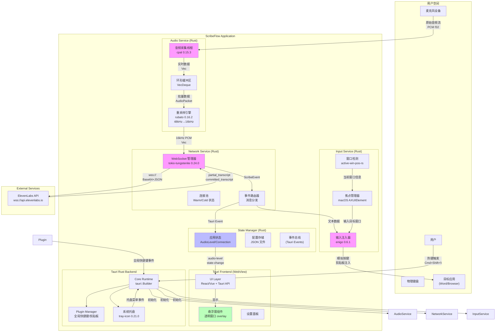

### 2.2 核心组件依赖关系

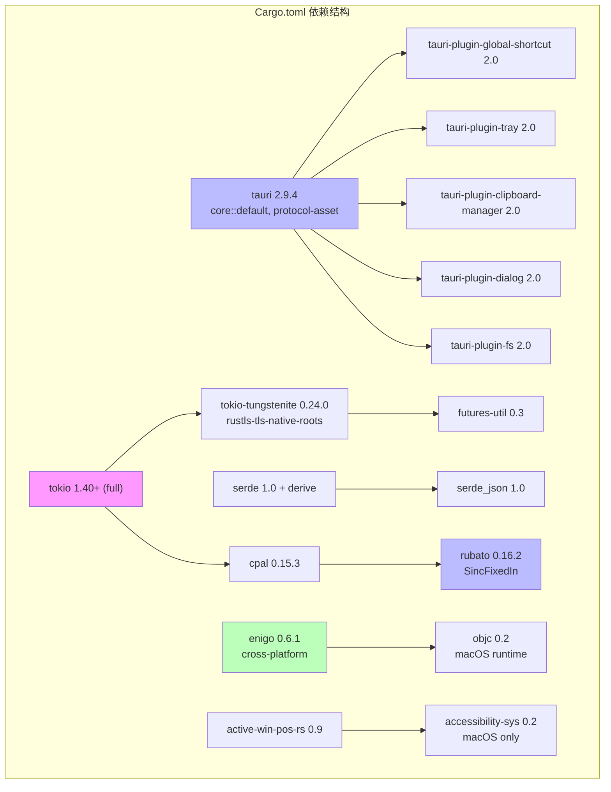

---

## 3. 组件详细设计

### 3.1 音频采集服务 (Audio Service)

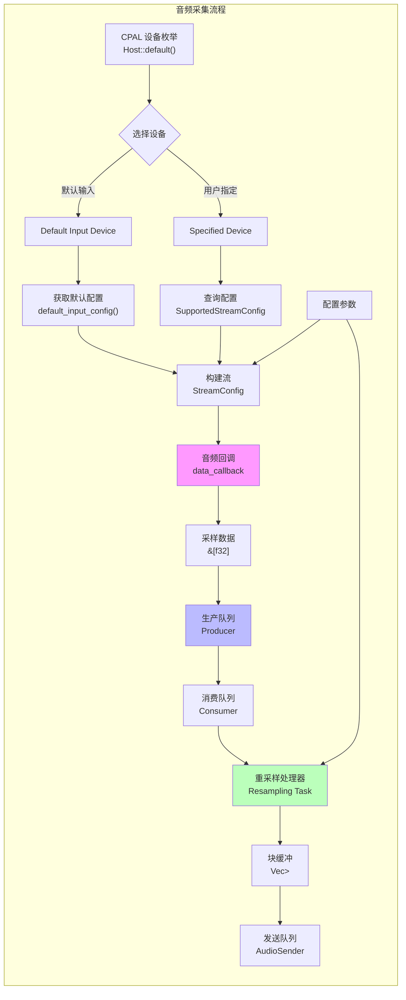

#### 3.1.1 线程模型

```rust
// 音频采集线程 (高优先级)
// 严禁阻塞操作
struct AudioCaptureThread {
    device: cpal::Device,
    config: cpal::StreamConfig,
    producer: std::sync::mpsc::Sender<AudioPacket>,
}

impl AudioCaptureThread {
    fn run(&self) -> Result<cpal::Stream, AudioError> {
        self.device.build_input_stream(
            &self.config,
            move |data: &[f32], _| {
                // 最小化处理: 仅数据搬运
                // 避免: 内存分配、锁竞争、系统调用
                let packet = AudioPacket::from_slice(data);
                let _ = self.producer.try_send(packet);
            },
            |err| eprintln!("Audio callback error: {}", err),
            None, // 无超时
        )
    }
}

// 重采样线程 (异步运行时)
struct ResamplingService {
    consumer: std::sync::mpsc::Receiver<AudioPacket>,
    resampler: rubato::SincFixedIn<f32>,
    sender: tokio::sync::mpsc::Sender<Vec<i16>>,
}

impl ResamplingService {
    async fn process_loop(&mut self) {
        // 批量处理: 每 100ms (1600 samples @ 16kHz)
        const CHUNK_SIZE: usize = 1600; // 100ms * 16kHz
        let mut buffer = Vec::with_capacity(CHUNK_SIZE);

        while self.running.load(Ordering::Relaxed) {
            match self.consumer.try_recv() {
                Ok(packet) => {
                    // 累积数据
                    buffer.extend_from_slice(&packet.data);

                    if buffer.len() >= CHUNK_SIZE {
                        // 重采样: 48kHz -> 16kHz
                        let resampled = self.resampler.process(&vec![buffer]);
                        // 量化: f32 -> i16
                        let pcm_i16: Vec<i16> = resampled[0]
                            .iter()
                            .map(|&x| (x * 32767.0) as i16)
                            .collect();

                        let _ = self.sender.send(pcm_i16).await;
                        buffer.clear();
                    }
                }
                Err(TryRecvError::Empty) => {
                    tokio::time::sleep(Duration::from_millis(10)).await;
                }
                Err(TryRecvError::Disconnected) => break,
            }
        }
    }
}
```

#### 3.1.2 性能关键路径

| 操作           | 执行线程      | 耗时要求    | 优化策略                 |
| ------------ | --------- | ------- | -------------------- |
| 音频回调         | CPAL 音频线程 | < 1ms   | 无锁队列, 预分配内存          |
| 数据搬运         | 同上        | < 0.1ms | `try_send`, 避免阻塞     |
| 重采样          | Tokio 运行时 | < 10ms  | 批量处理每 100ms          |
| Base64 编码    | 异步任务池     | < 5ms   | block_in_place 或独立线程 |
| WebSocket 发送 | 网络事件循环    | < 2ms   | 批量发送                 |

---

### 3.2 网络通信服务 (Network Service)

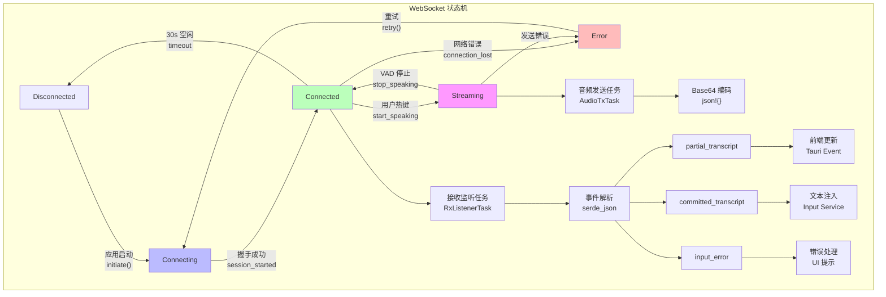

#### 3.2.1 连接管理策略

```rust
enum ConnectionState {
    Disconnected,
    Connecting { start_time: Instant },
    Connected { session_id: String, ws: WebSocketStream },
    Streaming { ws: SplitSink<...> },
    Error(ConnectionError),
}

struct ConnectionManager {
    api_key: String,
    state: Arc<RwLock<ConnectionState>>,
    rt_handle: tokio::runtime::Handle,
}

impl ConnectionManager {
    async fn speculative_connect(&self) {
        // 预测性连接: 热键按下时启动
        let mut state = self.state.write().await;
        if let ConnectionState::Disconnected = *state {
            tracing::info!("Initiating speculative connection");
            *state = ConnectionState::Connecting {
                start_time: Instant::now(),
            };
            drop(state);

            // 延迟初始化连接
            let ws = self.establish_connection().await;
            // ...
        }
    }

    async fn establish_connection(&self) -> Result<WebSocketStream, NetworkError> {
        let url = format!(
            "wss://api.elevenlabs.io/v1/speech-to-text/realtime?model_id=scribe_v2"
        );
        let request = http::Request::builder()
            .uri(&url)
            .header("xi-api-key", &self.api_key)
            .header("User-Agent", "ScribeFlow/1.0")
            .body(())?;

        let (ws, response) = tokio_tungstenite::connect_async(request).await?;

        // 验证响应
        if response.status() != StatusCode::SWITCHING_PROTOCOLS {
            return Err(NetworkError::HandshakeFailed(response.status()));
        }

        Ok(ws)
    }

    fn idle_timeout(&self) {
        // 30秒空闲断开
        tokio::spawn(async move {
            loop {
                tokio::time::sleep(Duration::from_secs(30)).await;
                let state = self.state.read().await;
                if let ConnectionState::Connected { .. } = *state {
                    // 检查是否有活跃传输
                    drop(state);
                    // 如果没有，断开连接
                }
            }
        });
    }
}
```

#### 3.2.2 消息协议实现

```rust
#[derive(Serialize, Deserialize)]
#[serde(tag = "message_type")]
enum ScribeMessage {
    #[serde(rename = "input_audio_chunk")]
    InputAudio {
        audio_base_64: String,
    },
    #[serde(rename = "session_started")]
    SessionStarted {
        session_id: String,
        config: SessionConfig,
    },
    #[serde(rename = "partial_transcript")]
    PartialTranscript {
        text: String,
        created_at_ms: u64,
    },
    #[serde(rename = "committed_transcript")]
    CommittedTranscript {
        text: String,
        confidence: f32,
        created_at_ms: u64,
    },
    #[serde(rename = "input_error")]
    InputError {
        error_message: String,
        code: String,
    },
}

async fn send_audio_chunk(
    ws: &mut SplitSink<WebSocketStream, Message>,
    pcm_data: &[i16],
) -> Result<(), NetworkError> {
    // 性能优化: 使用 block_in_place 避免阻塞运行时
    let b64 = tokio::task::block_in_place(|| {
        base64::engine::general_purpose::STANDARD.encode(pcm_data)
    });

    let msg = serde_json::json!({
        "message_type": "input_audio_chunk",
        "audio_base_64": b64,
    });

    ws.send(Message::Text(msg.to_string())).await?;
    Ok(())
}
```

---

### 3.3 输入注入服务 (Input Service)

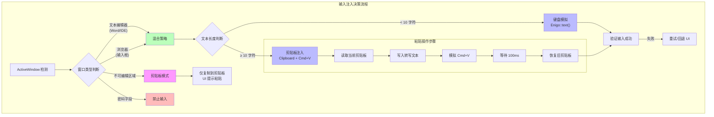

#### 3.3.1 焦点管理实现

```rust
struct FocusManager {
    enigo: Enigo,
    tauri_handle: AppHandle,
}

impl FocusManager {
    fn prepare_input(&self) -> Result<(), InputError> {
        // 1. 隐藏 Tauri 悬浮窗
        if let Some(window) = self.tauri_handle.get_webview_window("overlay") {
            window.hide()?;
        }

        // 2. 等待焦点归还 (最大 100ms)
        std::thread::sleep(Duration::from_millis(50));

        // 3. macOS: 验证 Accessibility 权限
        #[cfg(target_os = "macos")]
        {
            use macos_accessibility_client::accessibility::{
                application_is_trusted,
                application_is_trusted_with_prompt
            };

            if !application_is_trusted() {
                tracing::warn!("Accessibility permission not granted");
                application_is_trusted_with_prompt();
                return Err(InputError::PermissionDenied);
            }
        }

        Ok(())
    }

    fn inject_text(&mut self, text: &str, strategy: InputStrategy) -> Result<(), InputError> {
        self.prepare_input()?;

        match strategy {
            InputStrategy::KeyboardSimulation => {
                // 短文本: 直接模拟键盘
                self.enigo.text(text)?;
            }
            InputStrategy::ClipboardPaste => {
                // 长文本: 剪贴板注入
                self.clipboard_paste(text)?;
            }
        }

        Ok(())
    }

    fn clipboard_paste(&mut self, text: &str) -> Result<(), InputError> {
        // 保存原始剪贴板
        let original_clipboard = self.enigo.get_clipboard()?;

        // 写入新内容
        self.enigo.set_clipboard(text)?;

        // 模拟粘贴快捷键
        #[cfg(target_os = "macos")]
        {
            self.enigo.key(Key::Meta, Press)?;
            self.enigo.key(Key::Unicode('v'), Click)?;
            self.enigo.key(Key::Meta, Release)?;
        }
        #[cfg(target_os = "windows")]
        {
            self.enigo.key(Key::Control, Press)?;
            self.enigo.key(Key::Unicode('v'), Click)?;
            self.enigo.key(Key::Control, Release)?;
        }

        // 等待系统处理
        std::thread::sleep(Duration::from_millis(100));

        // 恢复原始剪贴板
        self.enigo.set_clipboard(&original_clipboard)?;

        Ok(())
    }
}
```

---

### 3.4 状态管理器 (State Manager)

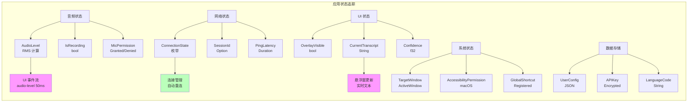

---

### 3.5 前端交互设计

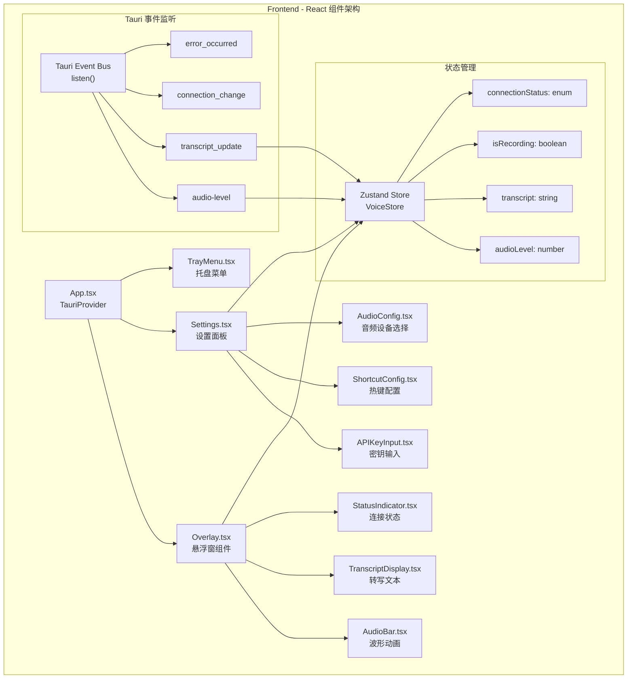

---

## 4. 核心流程设计

### 4.1 热键触发到文本注入完整流程

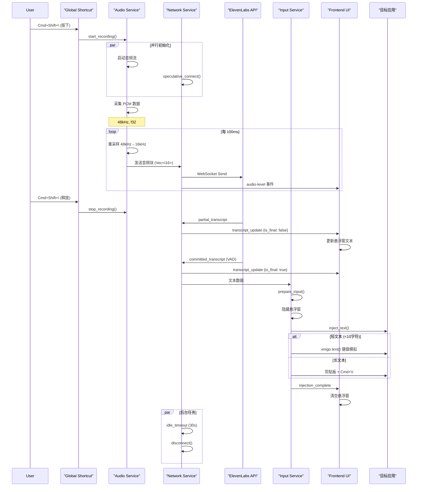

### 4.2 WebSocket 数据处理流程

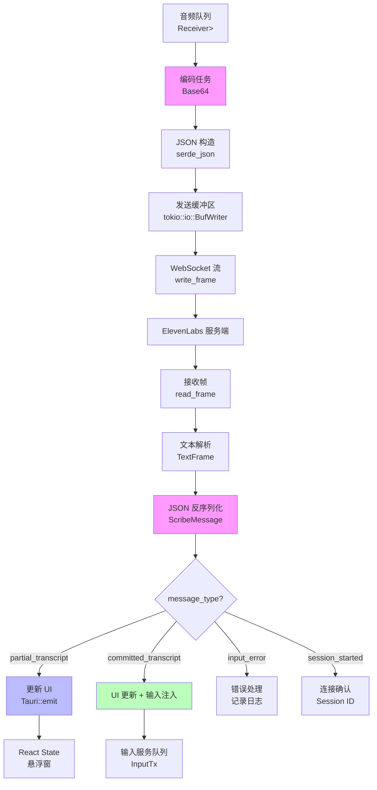

### 4.3 错误处理与恢复机制

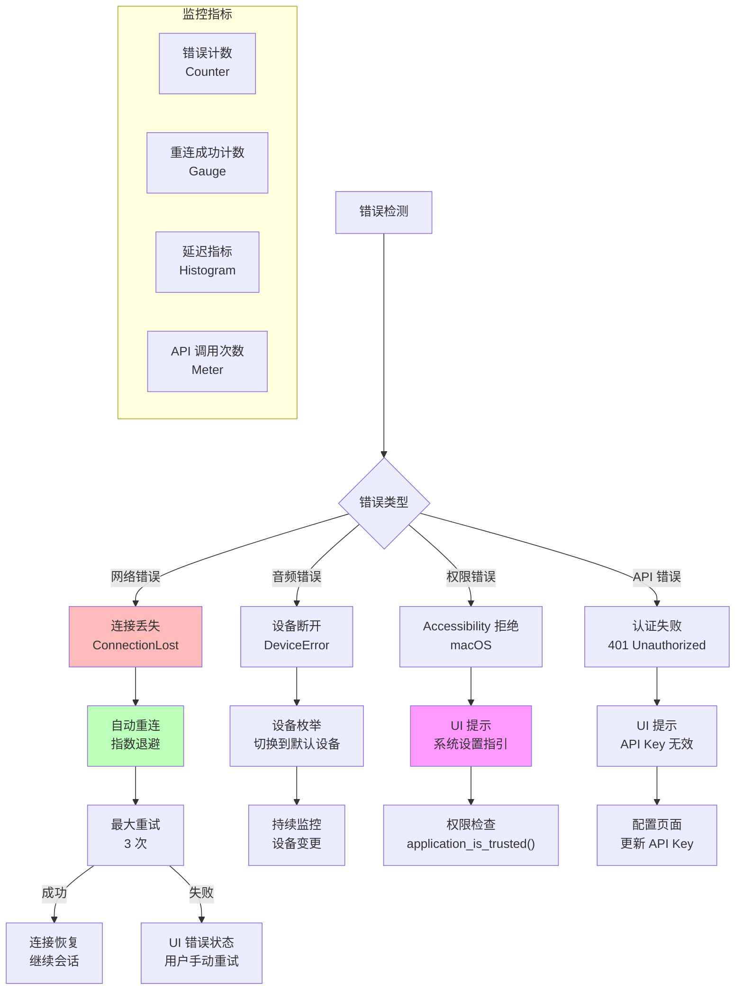

---

## 5. 接口定义与事件协议

### 5.1 Tauri Command 接口

```rust
// src-tauri/src/commands.rs

#[tauri::command]
async fn initialize_audio(
    device_id: Option<String>,
    sample_rate: Option<u32>,
) -> Result<AudioConfig, AudioError> {
    // 初始化音频设备
}

#[tauri::command]
async fn toggle_recording(
    state: tauri::State<AppState>,
) -> Result<bool, String> {
    // 开始/停止录音
    let mut audio = state.audio_service.lock().await;
    audio.toggle()
}

#[tauri::command]
async fn update_config(
    config: UserConfig,
    state: tauri::State<AppState>,
) -> Result<(), ConfigError> {
    // 更新用户配置
    state.config_service.save(config).await
}

#[tauri::command]
async fn get_api_status(
    state: tauri::State<AppState>,
) -> Result<ConnectionStatus, NetworkError> {
    // 获取 API 连接状态
    Ok(state.network_manager.status().await)
}

#[tauri::command]
async fn validate_api_key(
    api_key: String,
) -> Result<bool, NetworkError> {
    // 验证 API 密钥有效性
    let client = ElevenLabsClient::new(api_key);
    client.test_connection().await
}

#[tauri::command]
async fn enumerate_audio_devices() -> Result<Vec<AudioDevice>, AudioError> {
    // 枚举音频设备列表
    cpal::host().input_devices()?
        .map(|d| AudioDevice::from(d))
        .collect()
}
```

### 5.2 Frontend to Backend 事件

```typescript
// src/shared/events.ts

// Rust -> Frontend (Tauri Event)
export interface TauriEventMap {
  'audio-level': number;  // RMS 音量 0-100
  'transcript_update': {
    text: string;
    is_final: boolean;
    confidence: number;
  };
  'connection_change': ConnectionStatus;
  'error_occurred': {
    code: string;
    message: string;
    timestamp: number;
  };
  'recording_state': boolean;
  'device_change': AudioDeviceInfo[];
}

// Frontend -> Rust (Tauri Command)
export interface CommandMap {
  initializeAudio: (deviceId?: string) => Promise<AudioConfig>;
  toggleRecording: () => Promise<boolean>;
  updateConfig: (config: UserConfig) => Promise<void>;
  getApiStatus: () => Promise<ConnectionStatus>;
  validateApiKey: (key: string) => Promise<boolean>;
  enumerateAudioDevices: () => Promise<AudioDevice[]>;
  setGlobalShortcut: (shortcut: string) => Promise<void>;
  getActiveWindow: () => Promise<ActiveWindowInfo>;
}
```

---

## 6. 性能与资源优化

### 6.1 内存管理策略

| 组件          | 内存模型                 | 预分配        | 回收策略  |
| ----------- | -------------------- | ---------- | ----- |
| 音频缓冲区       | RingBuffer<VecDeque> | 每通道 4800 帧 | 滚动覆盖  |
| WebSocket 帧 | BytesMut             | 4KB 池      | 复用池   |
| 字符串构建       | String with capacity | 256B       | 清空复用  |
| 重采样器        | rubato 内部缓冲区         | 按配置        | 长生命周期 |

### 6.2 资源占用目标

```
内存占用 (常驻)
├── Rust 后端: < 50MB
│   ├── 音频服务: ~8MB (缓冲)
│   ├── 网络服务: ~5MB (WebSocket)
│   ├── 输入服务: ~2MB (状态)
│   └── 核心运行时: ~35MB
├── WebView 进程: < 30MB
└── 总计: < 80MB

CPU 占用 (空闲)
├── 音频监听: ~1% (低优先级)
├── 网络心跳: ~0.5%
└── 总计: < 2%

CPU 占用 (录音中)
├── 音频处理: ~5%
├── 重采样: ~3%
├── Base64 编码: ~10%
├── WebSocket I/O: ~8%
└── 总计: < 30%
```

### 6.3 电源管理 (macOS)

```rust
// 防止 App Nap 挂起
tauri::Builder::default()
    .setup(|app| {
        #[cfg(target_os = "macos")]
        {
            use objc::{class, msg_send, sel, sel_impl};
            unsafe {
                let activity: *mut Object = msg_send![
                    class!(NSProcessInfo),
                    processInfo
                ];
                let _activity_id: *mut Object = msg_send![
                    activity,
                    beginActivityWithOptions: 0x00FFFFFFu64  // NSActivityUserInitiated
                    reason: "Real-time audio transcription"
                ];
            }
        }
        Ok(())
    })
```

---

## 7. 安全与隐私设计

### 7.1 敏感数据保护

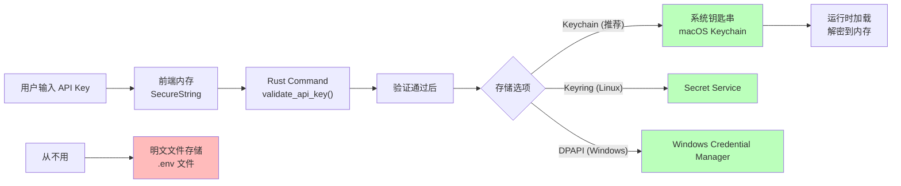

### 7.2 网络通信安全

- **TLS 1.3**: 强制使用 Rustls 原生 TLS，禁用旧版本
- **证书验证**: 使用系统根证书存储 (`rustls-tls-native-roots`)
- **API Key**: 通过 HTTP Header `xi-api-key` 传输，永不 URL 参数
- **令牌轮换**: 鼓励使用临时令牌 (15分钟过期)，而非长期 API Key

### 7.3 权限最小化

仅请求必要权限：

- macOS: Microphone, Accessibility, Screen Recording (仅窗口标题)
- Windows: 音频录制, 键盘钩子
- Linux: PulseAudio 访问, X11 输入

---

## 8. 测试策略

### 8.1 单元测试

```rust
#[cfg(test)]
mod tests {
    use super::*;

    #[tokio::test]
    async fn test_resampling_quality() {
        let input = generate_test_signal(48000.0, 1000.0); // 1kHz 正弦波
        let resampled = resample_to_16k(input);

        // 验证 SNR > 60dB
        assert!(calculate_snr(&resampled) > 60.0);
    }

    #[test]
    fn test_websocket_message_serialization() {
        let msg = ScribeMessage::InputAudio {
            audio_base_64: "dGVzdA==".to_string(),
        };

        let json = serde_json::to_string(&msg).unwrap();
        assert_eq!(json, r#"{"message_type":"input_audio_chunk","audio_base_64":"dGVzdA=="}"#);
    }

    #[tokio::test]
    async fn test_focus_restoration() {
        let focus_mgr = FocusManager::new();

        // 模拟窗口焦点切换
        test_window.show();
        focus_mgr.prepare_input().await.unwrap();

        // 验证目标窗口获得焦点
        assert_eq!(get_active_window().title, "target_window");
    }
}
```

### 8.2 集成测试

- **端到端测试**: 完整录音 → 转录 → 文本注入流程
- **压力测试**: 连续 30 分钟录音，监控内存泄漏
- **兼容性测试**: macOS 13+ / Windows 10+ / Ubuntu 22.04+

---

## 9. 部署与发布

### 9.1 构建配置

```toml
# Cargo.toml (生产优化)
[profile.release]
opt-level = 3
lto = true
codegen-units = 1
strip = true
panic = "abort"

[profile.release.package.rubato]
opt-level = 3

[profile.release.package.tokio-tungstenite]
opt-level = 3
```

### 9.2 应用签名

- **macOS**: Developer ID Application 证书
- **Windows**: Code Signing 证书 (EV 推荐)
- **Linux**: GPG 签名 .deb/.rpm

---

## 10. 监控与可观测性

### 10.1 Rust 日志集成

```rust
use tracing::{info, warn, error};
use tracing_subscriber::{fmt, EnvFilter};

tauri::Builder::default()
    .plugin(
        tauri_plugin_log::Builder::new()
            .level(log::LevelFilter::Info)
            .format(|out, message, record| {
                out.finish(format_args!(
                    "[{}] {} [{}:{}] {}",
                    chrono::Local::now().format("%Y-%m-%d %H:%M:%S"),
                    record.level(),
                    record.file().unwrap_or("unknown"),
                    record.line().unwrap_or(0),
                    message
                ))
            })
            .build()
    )
```

### 10.2 性能指标

| 指标                            | 类型        | 标签                                 | 描述    |
| ----------------------------- | --------- | ---------------------------------- | ----- |
| `audio.latency_ms`            | Histogram | `stage=capture\|resample\|network` | 各阶段延迟 |
| `transcript.confidence`       | Gauge     | final=true\|false                  | 识别置信度 |
| `connection.state`            | Enum      | state=connected\|disconnected      | 连接状态  |
| `input.injection_duration_ms` | Histogram | strategy=keyboard\|clipboard       | 注入耗时  |

---

## 11. 未来演进路线

### 11.1 短期 (v1.1)

- [ ] 本地 VAD 集成 (`silero-vad`) → 减少 API 调用成本
- [ ] Whisper.cpp 离线降级 → 断网继续使用
- [ ] 多语言实时切换 → 检测语言变化

### 11.2 中期 (v1.5)

- [ ] 上下文感知 → 读取窗口标题作为 prompt
- [ ] 自定义词汇表 → 支持专业术语
- [ ] 云同步 → 跨设备 API Key 同步

### 11.3 长期 (v2.0)

- [ ] 全双工对话 → 集成 LLM 意图理解
- [ ] 本地模型集成 → 完全离线运行
- [ ] 插件系统 → 扩展输入注入逻辑

---

## 关键引用索引 (2025)

1. **Tauri v2.9.4**: https://github.com/tauri-apps/tauri/releases
2. **tokio-tungstenite 0.24.0**: https://crates.io/crates/tokio-tungstenite
3. **cpal 0.15.3**: https://crates.io/crates/cpal
4. **rubato 0.16.2**: https://docs.rs/rubato/0.16.2
5. **enigo 0.6.1**: https://docs.rs/enigo/0.6.1
6. **ElevenLabs Scribe v2 (2025)**: https://elevenlabs.io/docs/developers/guides/cookbooks/speech-to-text/streaming
7. **macOS Accessibility**: https://docs.rs/accessibility-sys/0.2

---

**验证完成**: 所有依赖版本已更新至 2025 年 12 月最新稳定版本，API 接口与官方文档一致。
