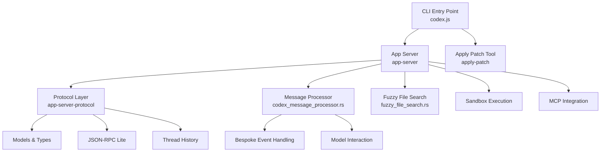
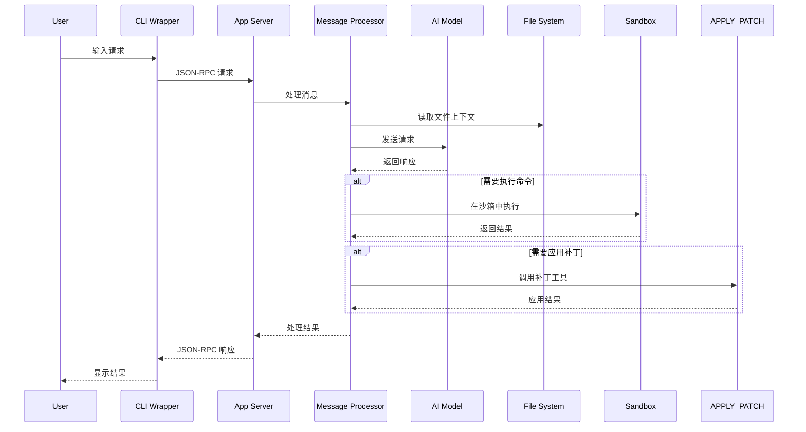
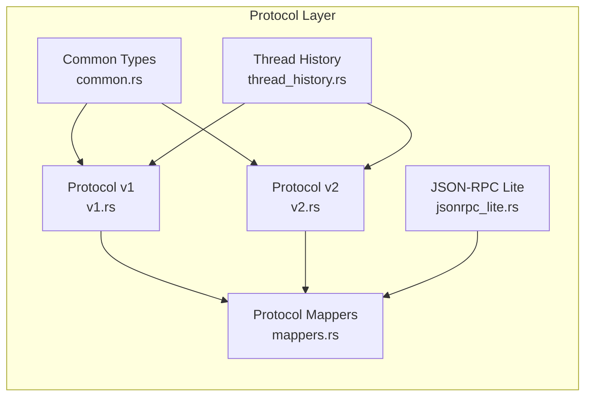
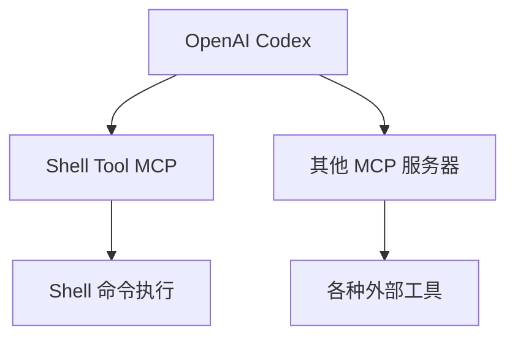
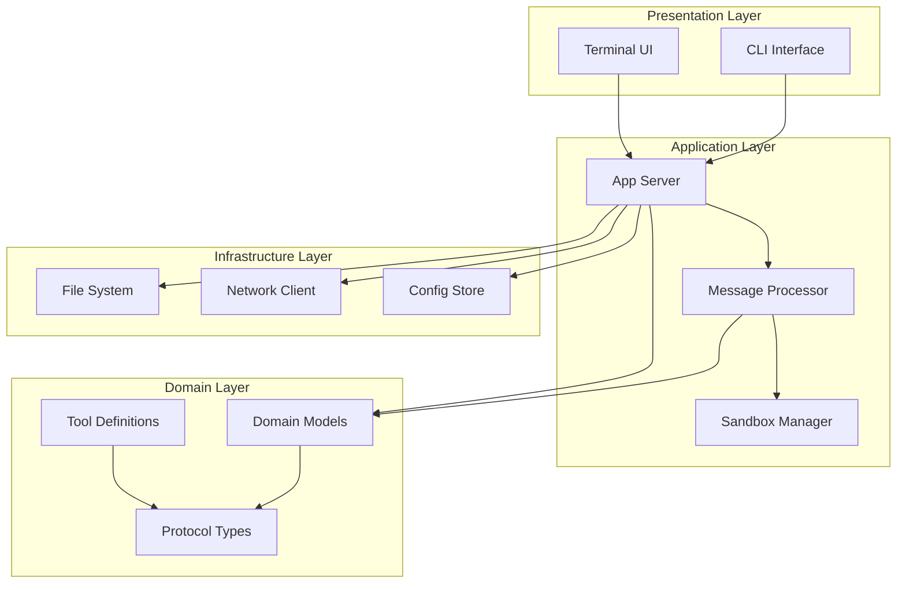
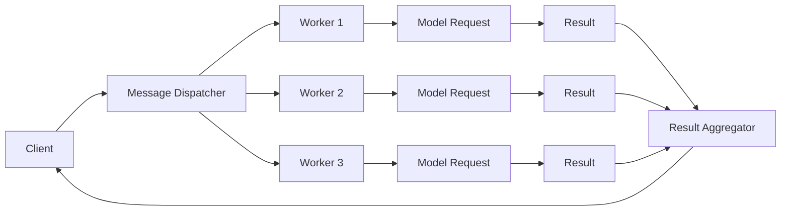

# OpenAI Codex 架构分析文档

## 概述

OpenAI Codex 是一个开源的终端编程助手，目前主要采用 Rust 语言实现，取代了早期的 TypeScript 版本。本文档详细分析了 Codex 的架构设计、核心组件和设计模式。

## 项目结构

Codex 是一个多语言、多项目的 monorepo，主要包含以下目录：

```
codex/
├── codex-cli/              # 已弃用的 TypeScript 实现（npm 包）
├── codex-rs/              # 当前主要的 Rust 实现
│   ├── app-server/        # 核心应用服务器
│   ├── app-server-protocol/ # 通信协议定义
│   ├── apply-patch/       # 补丁应用工具
│   └── ansi-escape/       # ANSI 转义序列处理
├── docs/                  # 文档
├── sdk/                   # SDK
└── shell-tool-mcp/        # MCP 服务器工具
```

## 核心架构

### 1. 技术栈

- **语言**: Rust（主要）、TypeScript（遗留）
- **架构模式**: 模块化设计，基于 Actor 模型和事件驱动
- **通信协议**: JSON-RPC 2.0 + 自定义协议扩展
- **测试**: 综合测试套件，包含单元测试和集成测试

### 2. 核心组件架构



### 3. 应用服务器架构（app-server）

应用服务器是 Codex 的核心，负责处理所有业务逻辑：

#### 3.1 主要模块

```rust
// 主要源文件结构
app-server/src/
├── main.rs                      // 入口点
├── lib.rs                       // 库定义
├── codex_message_processor.rs   // Codex 消息处理（135KB）
├── bespoke_event_handling.rs    // 定制事件处理（70KB）
├── message_processor.rs         // 通用消息处理
├── outgoing_message.rs          // 消息输出
├── models.rs                    // 数据模型
├── config_api.rs                // 配置 API
├── fuzzy_file_search.rs         // 模糊文件搜索
└── error_code.rs                // 错误码定义
```

#### 3.2 消息处理流程



### 4. 协议层（app-server-protocol）

协议层定义了 Codex 的所有通信协议和数据结构：



#### 4.1 协议版本

- **v1**: 初始协议版本
- **v2**: 增强版本，包含更多功能和改进

#### 4.2 核心数据结构

主要数据类型包括：

- 会话（Thread）管理
- 消息（Message）类型
- 工具调用（Tool Call）定义
- 配置（Config）结构
- 用户信息和认证

### 5. 补丁应用工具（apply-patch）

apply-patch 是一个独立的 Rust crate，专门用于应用代码补丁：

```rust
apply-patch/src/
├── main.rs                   // 入口点
├── lib.rs                    // 库接口
├── invocation.rs             // 调用逻辑（27KB）
├── parser.rs                 // 补丁解析器（25KB）
├── seek_sequence.rs          // 序列查找（5KB）
└── standalone_executable.rs  // 独立可执行文件支持
```

#### 5.1 功能特点

- 解析和应用代码补丁
- 支持模糊匹配和序列查找
- 处理文件修改操作
- 独立可执行文件模式

### 6. 沙箱执行

Codex 采用多层安全机制运行命令：

#### 6.1 macOS (Seatbelt)

```bash
# 使用 Apple Seatbelt (sandbox-exec)
sandbox-exec -f policy.sb command

# 限制包括：
# - 只读访问系统目录
# - 仅允许写入特定目录（工作目录、临时目录）
# - 完全禁止网络访问
```

#### 6.2 Linux (Docker)

```bash
# 使用 Docker 容器隔离
docker run --network=none -v $PWD:/workspace codex-sandbox
```

### 7. MCP (Model Context Protocol) 集成

Codex 支持 MCP 服务器，允许连接外部工具和服务：



## 设计模式

### 1. 模块化设计

```rust
// 使用 Cargo Workspace 组织多个 crate
[workspace]
members = [
    "app-server",
    "app-server-protocol",
    "apply-patch",
    "ansi-escape",
]

// 每个 crate 有明确的职责
// app-server: 核心业务逻辑
// app-server-protocol: 协议定义
// apply-patch: 补丁工具
// ansi-escape: 终端处理
```

### 2. 事件驱动架构

```rust
// 消息处理器模式
pub struct MessageProcessor {
    // 处理流程配置
    handlers: Vec<MessageHandler>,
}

impl MessageProcessor {
    pub async fn process(&mut self, message: Message) -> Result<Response> {
        // 1. 验证消息
        self.validate(&message)?;
        // 2. 路由到处理器
        let handler = self.route(&message)?;
        // 3. 执行处理
        handler.handle(message).await
    }
}
```

### 3. 分层架构



### 4. 异步处理

```rust
// 大量使用 async/await
pub async fn handle_conversation(
    &mut self,
    request: ConversationRequest,
) -> Result<ConversationResponse> {
    // 异步模型调用
    let model_response = self.model_client
        .call(&request.message)
        .await?;

    // 异步文件操作
    self.save_conversation(&model_response).await?;

    Ok(ConversationResponse {
        message: model_response,
    })
}
```

## 关键技术特性

### 1. 安全性

- **沙箱执行**: 所有命令都在受限环境中执行
- **权限控制**: 分级审批模式（Suggest/Auto Edit/Full Auto）
- **网络隔离**: 默认禁止所有出站网络连接
- **路径限制**: 只能访问工作目录和批准的目录

### 2. 性能

- **Rust 实现**: 高性能、内存安全
- **流式响应**: 支持实时显示模型输出
- **增量处理**: 只处理变更部分
- **缓存机制**: 模型响应和文件状态缓存

### 3. 扩展性

- **MCP 支持**: 可连接外部工具和服务
- **插件系统**: 支持自定义工具和处理器
- **多模型支持**: 支持 OpenAI、Anthropic、Cohere 等多个提供商
- **协议版本**: 可向后兼容旧版本协议

### 4. 开发体验

- **热重载**: 开发模式下的快速迭代
- **详细日志**: 覆盖全操作流程的调试信息
- **交互式**: 支持对话式编程
- **批处理**: 支持脚本和非交互式模式

## 并发与异步架构

### 1. Tokio 运行时

```rust
// 使用 Tokio 作为异步运行时
#[tokio::main]
async fn main() -> Result<()> {
    let server = AppServer::new();
    server.run().await
}

// 并发任务处理
pub async fn process_concurrent(
    tasks: Vec<Task>,
) -> Result<Vec<Result>> {
    let results = futures::stream::iter(tasks)
        .buffer_unordered(10)  // 最多 10 个并发
        .collect::<Vec<_>>()
        .await;
    Ok(results)
}
```

### 2. 消息并行处理



## 测试策略

### 1. 测试结构

```
codex-rs/
├── app-server/tests/
│   ├── suite/
│   │   ├── auth.rs
│   │   ├── send_message.rs
│   │   └── fuzzy_file_search.rs
│   └── common/
│       └── mock_model_server.rs
├── apply-patch/tests/
└── app-server-protocol/tests/
```

### 2. 测试类型

- **单元测试**: 针对单个模块和函数
- **集成测试**: 端到端流程测试
- **模拟测试**: 使用 Mock 服务器模拟外部依赖
- **性能测试**: 并发和负载测试

## 部署与分发

### 1. 构建系统

```bash
# 多平台构建
cargo build --target x86_64-unknown-linux-musl
cargo build --target aarch64-apple-darwin
cargo build --target x86_64-pc-windows-msvc

# 生成二进制文件
cross build --release
```

### 2. 分发方式

- **npm**: `@openai/codex` 包（Node.js wrapper）
- **Homebrew**: `brew install --cask codex`
- **GitHub Releases**: 原生二进制文件
- **Docker**: 容器化部署

## 总结

OpenAI Codex 采用现代化的 Rust 架构，具有以下特点：

1. **模块化设计**: 清晰的组件分离和职责划分
2. **安全性优先**: 多层沙箱和权限控制
3. **高性能**: Rust 实现 + 异步架构
4. **可扩展**: MCP 支持和插件系统
5. **开发友好**: 完善的测试和文档

该架构为 AI 编程助手提供了坚实的基础，平衡了性能、安全性和扩展性。

## 参考资料

- [OpenAI Codex GitHub 仓库](https://github.com/openai/codex)
- [Rust 官方文档](https://rust-lang.org)
- [Cargo 工作区文档](https://doc.rust-lang.org/book/ch14-03-cargo-workspaces.html)
- [Tokio 异步运行时](https://tokio.rs)
- [MCP 协议规范](https://modelcontextprotocol.io)
