# Open Notebook 架构设计分析

> **分析时间**: 2025-12-25  
> **项目版本**: v1.x (Next.js + FastAPI 架构)  
> **分析工具**: Qoder AI Assistant

---

## 1. 项目概述

Open Notebook 是一个 **隐私优先、自托管** 的研究助手应用，作为 Google Notebook LM 的开源替代品。它允许用户：

- 管理多来源研究内容（PDF、视频、音频、网页等）
- 与 AI 进行基于上下文的对话
- 生成专业级播客内容
- 支持 16+ AI 提供商（OpenAI, Anthropic, Ollama 等）

### 1.1 技术栈概览

| 层级 | 技术选型 |
|------|----------|
| **前端** | Next.js 14, React, TypeScript, Tailwind CSS |
| **后端** | Python, FastAPI, Pydantic |
| **数据库** | SurrealDB (多模型数据库) |
| **AI 集成** | LangGraph, LangChain, Esperanto |
| **任务处理** | surreal-commands (后台任务) |
| **内容处理** | content-core, Docling |

---

## 2. 系统架构总览

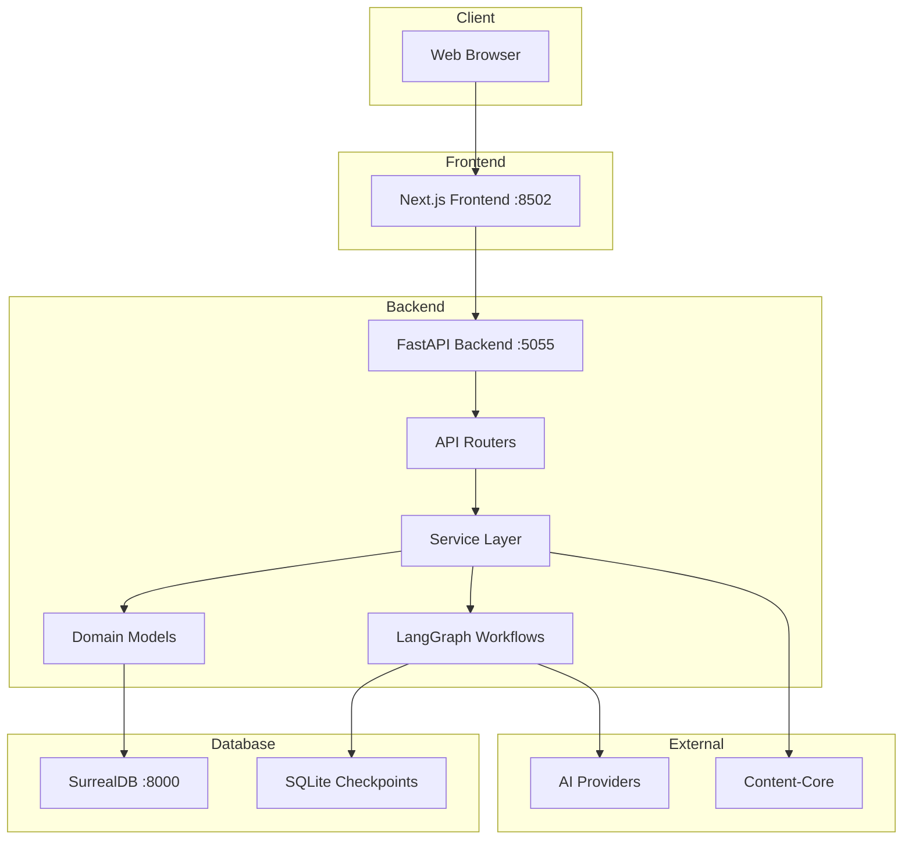

---

## 3. 核心架构分层

### 3.1 分层架构图

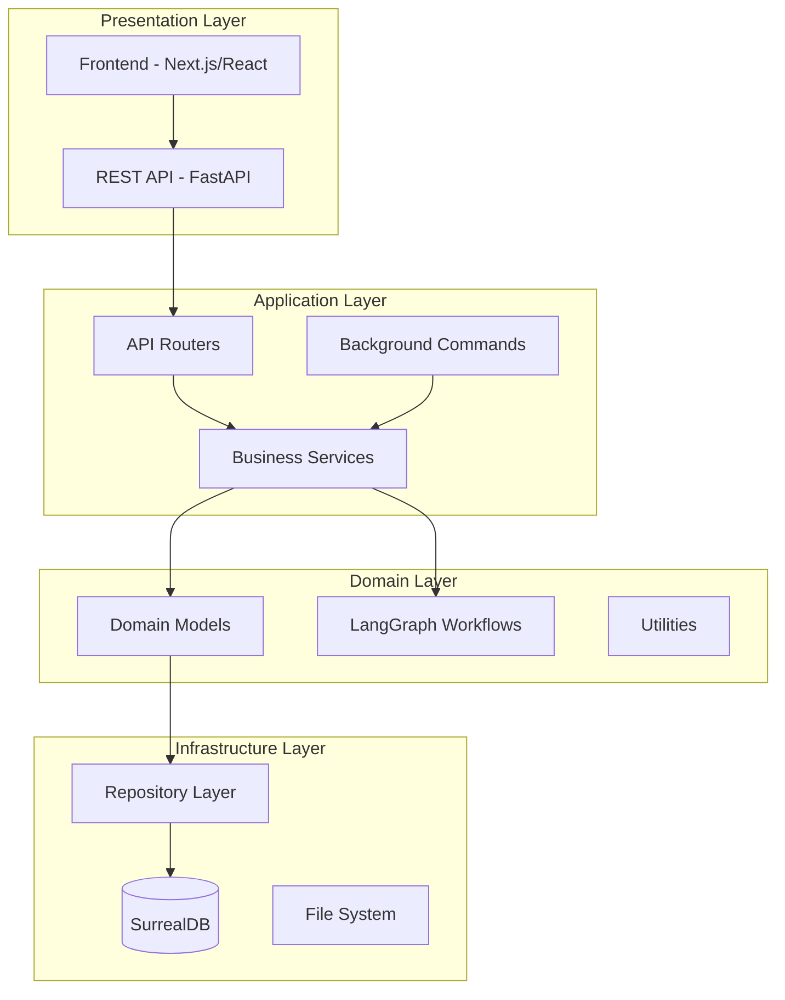

### 3.2 各层职责

| 层级 | 职责 | 关键组件 |
|------|------|----------|
| **Presentation** | 用户界面、API 暴露 | Next.js, FastAPI Routers |
| **Application** | 业务流程编排、请求处理 | Services, Commands |
| **Domain** | 核心业务逻辑、领域模型 | ObjectModel, LangGraph |
| **Infrastructure** | 数据持久化、外部服务 | Repository, SurrealDB |

---

## 4. 后端架构详解

### 4.1 目录结构

```
open_notebook/
├── api/                    # API 层
│   ├── main.py            # FastAPI 应用入口
│   ├── models.py          # API 请求/响应模型 (Pydantic)
│   ├── auth.py            # 认证中间件
│   ├── routers/           # API 路由模块
│   │   ├── notebooks.py   # 笔记本 CRUD
│   │   ├── sources.py     # 来源管理
│   │   ├── notes.py       # 笔记管理
│   │   ├── chat.py        # 聊天功能
│   │   ├── podcasts.py    # 播客生成
│   │   ├── search.py      # 搜索功能
│   │   └── ...
│   └── *_service.py       # API 层服务
│
├── open_notebook/          # 核心库
│   ├── domain/            # 领域模型
│   │   ├── base.py        # ObjectModel 基类
│   │   ├── notebook.py    # Notebook, Source, Note
│   │   ├── podcast.py     # Podcast 相关模型
│   │   └── models.py      # AI Model 管理
│   │
│   ├── database/          # 数据库层
│   │   ├── repository.py  # CRUD 操作封装
│   │   └── async_migrate.py # 数据库迁移
│   │
│   ├── graphs/            # LangGraph 工作流
│   │   ├── chat.py        # 聊天工作流
│   │   ├── source.py      # 来源处理工作流
│   │   └── transformation.py
│   │
│   └── utils/             # 工具函数
│       ├── context_builder.py  # 上下文构建
│       └── text_utils.py       # 文本处理
│
├── commands/              # 后台任务命令
│   ├── embedding_commands.py
│   ├── podcast_commands.py
│   └── source_commands.py
│
└── prompts/               # Jinja2 提示模板
    ├── chat.jinja
    └── podcast/
```

### 4.2 领域模型设计

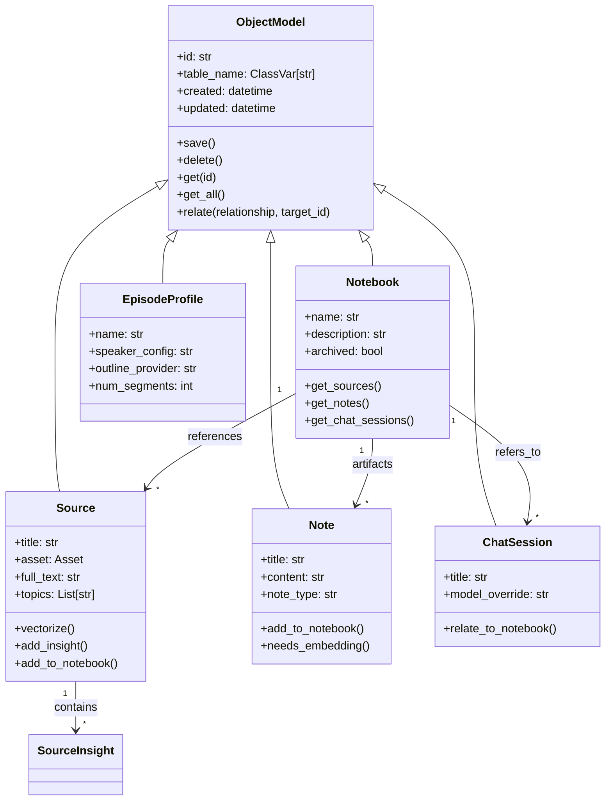

### 4.3 Repository 模式

Repository 层封装了所有 SurrealDB 操作：

```python
# 核心函数
async def repo_query(query_str, vars)    # 执行 SurrealQL 查询
async def repo_create(table, data)       # 创建记录
async def repo_update(table, id, data)   # 更新记录
async def repo_delete(record_id)         # 删除记录
async def repo_relate(source, rel, target) # 创建关系
async def repo_upsert(table, id, data)   # 更新或插入
```

**关键设计**:
- 使用 `AsyncSurreal` 异步客户端
- `ensure_record_id()` 确保 ID 格式一致
- `parse_record_ids()` 递归转换 RecordID 为字符串

---

## 5. 前端架构详解

### 5.1 目录结构

```
frontend/src/
├── app/                   # Next.js App Router
│   ├── (auth)/           # 认证相关页面
│   ├── (dashboard)/      # 仪表板页面
│   │   ├── notebooks/    # 笔记本管理
│   │   ├── sources/      # 来源管理
│   │   ├── search/       # 搜索页面
│   │   └── podcasts/     # 播客页面
│   ├── layout.tsx        # 根布局
│   └── globals.css       # 全局样式
│
├── components/            # React 组件
│   ├── ui/               # 基础 UI 组件 (shadcn/ui)
│   ├── common/           # 通用组件
│   ├── notebooks/        # 笔记本组件
│   ├── sources/          # 来源组件
│   ├── podcasts/         # 播客组件
│   └── layout/           # 布局组件
│
├── lib/                   # 库函数
│   ├── api/              # API 客户端
│   │   ├── client.ts     # HTTP 客户端
│   │   ├── notebooks.ts  # 笔记本 API
│   │   ├── sources.ts    # 来源 API
│   │   └── chat.ts       # 聊天 API
│   │
│   ├── hooks/            # React Hooks
│   ├── stores/           # 状态管理
│   ├── types/            # TypeScript 类型
│   └── utils/            # 工具函数
│
└── middleware.ts          # Next.js 中间件
```

### 5.2 前端架构图

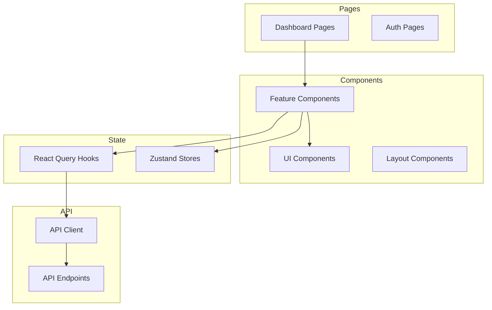

### 5.3 API 客户端设计

```typescript
// lib/api/client.ts
const client = {
  get: (url) => fetch(API_BASE_URL + url),
  post: (url, data) => fetch(API_BASE_URL + url, { method: 'POST', body: data }),
  // ...
}

// 模块化 API
// lib/api/notebooks.ts
export const notebooksApi = {
  list: () => client.get('/notebooks'),
  create: (data) => client.post('/notebooks', data),
  // ...
}
```

---

## 6. 数据流架构

### 6.1 请求处理流程

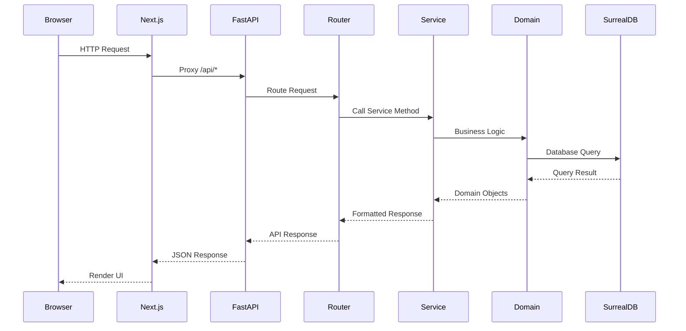

### 6.2 来源处理工作流

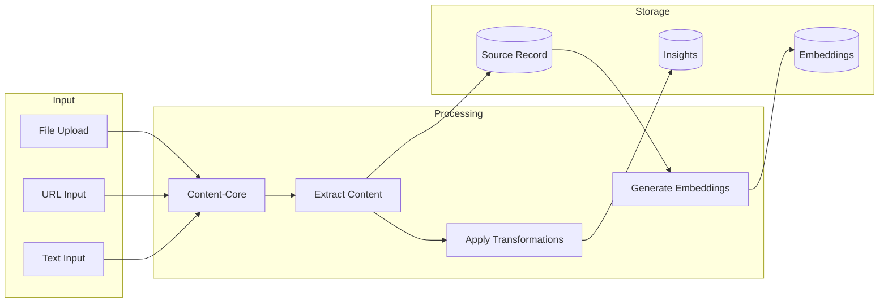

### 6.3 聊天工作流 (LangGraph)

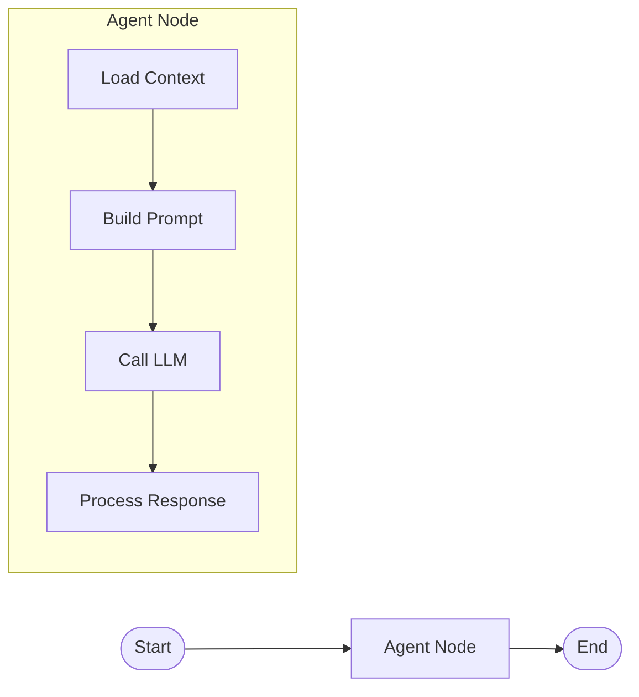

---

## 7. 后台任务系统

### 7.1 Commands 架构

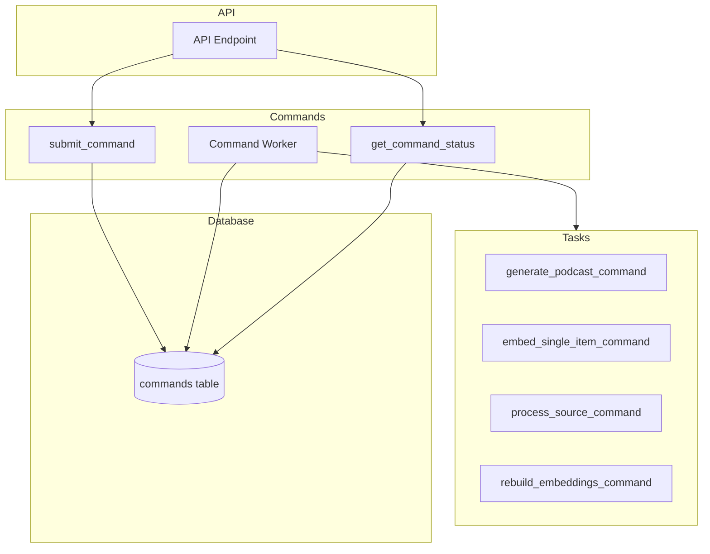

### 7.2 命令类型

| 命令 | 用途 | 异步处理 |
|------|------|---------|
| `process_source_command` | 处理上传的来源内容 | ✅ |
| `embed_single_item_command` | 为单个项目生成向量 | ✅ |
| `rebuild_embeddings_command` | 重建所有向量 | ✅ |
| `generate_podcast_command` | 生成播客 | ✅ |

---

## 8. AI 集成架构

### 8.1 多提供商支持

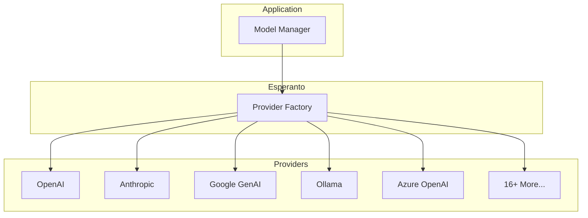

### 8.2 模型类型

| 类型 | 用途 | 默认配置 |
|------|------|---------|
| **Language** | 聊天、转换、推理 | `default_chat_model` |
| **Embedding** | 向量搜索 | `default_embedding_model` |
| **Speech-to-Text** | 音频转文字 | `default_speech_to_text_model` |
| **Text-to-Speech** | 播客生成 | `default_text_to_speech_model` |

### 8.3 LangGraph 工作流

项目使用 LangGraph 构建复杂的 AI 工作流：

```python
# open_notebook/graphs/chat.py
class ThreadState(TypedDict):
    messages: Annotated[list, add_messages]
    notebook: Optional[Notebook]
    context: Optional[str]
    model_override: Optional[str]

agent_state = StateGraph(ThreadState)
agent_state.add_node("agent", call_model_with_messages)
agent_state.add_edge(START, "agent")
agent_state.add_edge("agent", END)
graph = agent_state.compile(checkpointer=memory)
```

---

## 9. 数据库设计

### 9.1 SurrealDB 模型

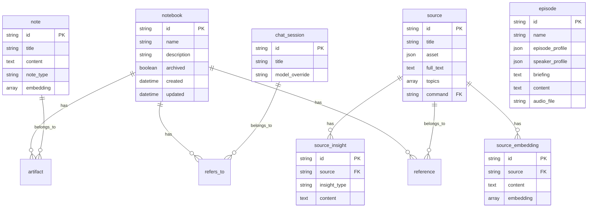

### 9.2 关系类型

| 关系 | 说明 | 示例 |
|------|------|------|
| `reference` | Source -> Notebook | `source:xxx->reference->notebook:yyy` |
| `artifact` | Note -> Notebook | `note:xxx->artifact->notebook:yyy` |
| `refers_to` | ChatSession -> Notebook/Source | 多态关系 |

---

## 10. 搜索架构

### 10.1 双模式搜索

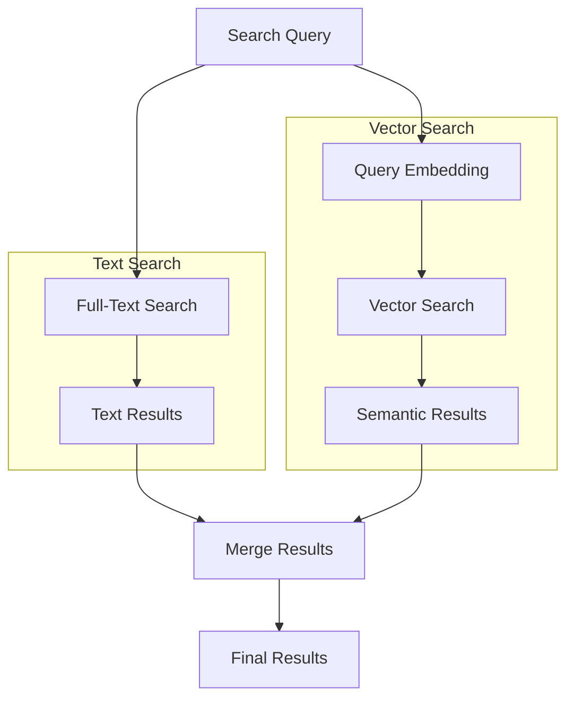

### 10.2 搜索函数

```python
# 文本搜索
async def text_search(keyword, results, source=True, note=True):
    return await repo_query(
        "select * from fn::text_search($keyword, $results, $source, $note)",
        {"keyword": keyword, ...}
    )

# 向量搜索
async def vector_search(keyword, results, minimum_score=0.2):
    embed = await EMBEDDING_MODEL.aembed([keyword])
    return await repo_query(
        "SELECT * FROM fn::vector_search($embed, $results, ...)",
        {"embed": embed[0], ...}
    )
```

---

## 11. 上下文构建系统

### 11.1 ContextBuilder 设计

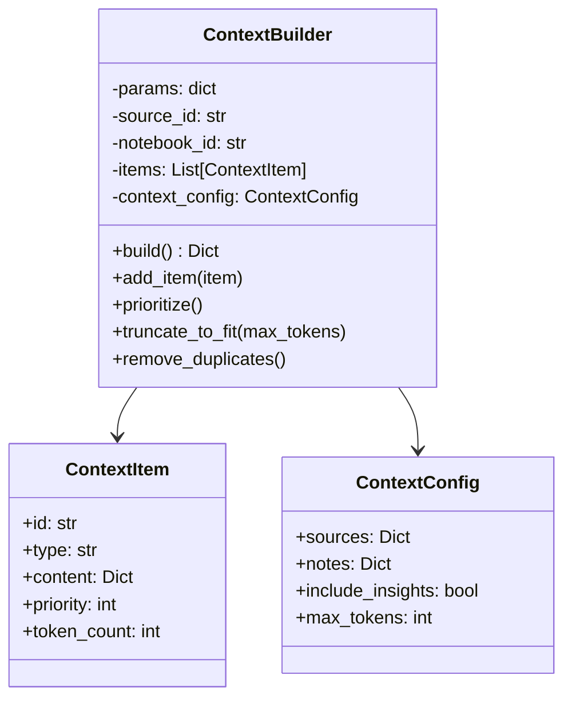

### 11.2 上下文级别

| 级别 | 包含内容 | 使用场景 |
|------|---------|---------|
| `not in` | 不包含 | 排除特定来源 |
| `insights` | 标题 + 洞察 | 默认模式 |
| `full content` | 完整文本 | 深度分析 |

---

## 12. 播客生成架构

### 12.1 播客生成流程

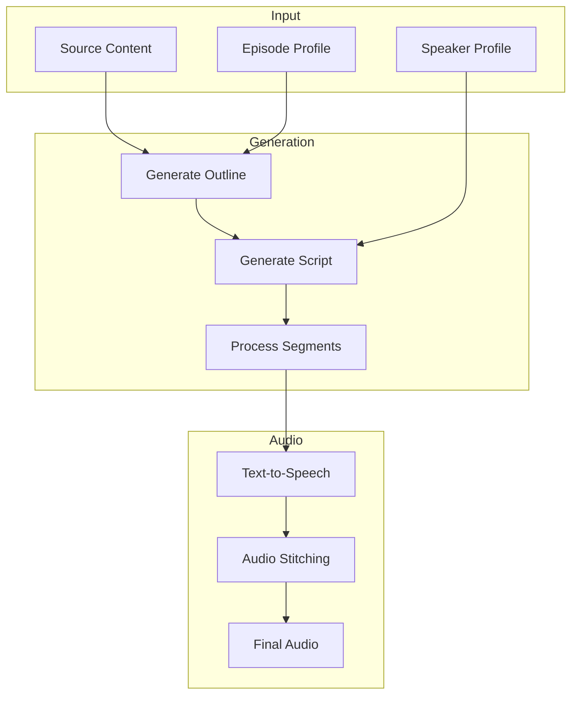

### 12.2 配置模型

```python
class EpisodeProfile:
    name: str                    # 配置名称
    speaker_config: str          # 关联的 SpeakerProfile
    outline_provider: str        # 大纲生成 AI 提供商
    outline_model: str           # 大纲生成模型
    transcript_provider: str     # 脚本生成提供商
    transcript_model: str        # 脚本生成模型
    num_segments: int            # 段落数量 (3-20)

class SpeakerProfile:
    name: str                    # 配置名称
    tts_provider: str            # TTS 提供商
    tts_model: str               # TTS 模型
    speakers: List[Dict]         # 1-4 个说话者配置
```

---

## 13. 设计原则

项目遵循以下核心设计原则：

### 13.1 六大原则

| 原则 | 描述 |
|------|------|
| **隐私优先** | 数据由用户控制，支持本地部署 |
| **简洁胜于功能** | 聚焦核心功能，避免过度设计 |
| **API 优先** | 所有功能通过 API 暴露 |
| **多提供商灵活性** | 不绑定单一 AI 提供商 |
| **标准化扩展** | 通过插件和模板扩展 |
| **异步优先** | 长时间操作不阻塞 UI |

### 13.2 架构反模式

项目明确避免的模式：
- ❌ 功能蔓延 (Feature Creep)
- ❌ 过早优化 (Premature Optimization)
- ❌ 过度工程 (Over-Engineering)
- ❌ 无迁移路径的破坏性变更

---

## 14. 部署架构

### 14.1 单容器部署

```mermaid
graph TB
    subgraph Docker Container
        Supervisor[Supervisord]
        Frontend[Next.js :8502]
        Backend[FastAPI :5055]
        DB[SurrealDB :8000]
    end

    subgraph Volumes
        Data[/app/data]
        DBData[/mydata]
    end

    Client[Browser] --> Frontend
    Frontend --> Backend
    Backend --> DB
    Backend --> Data
    DB --> DBData
```

### 14.2 分离部署

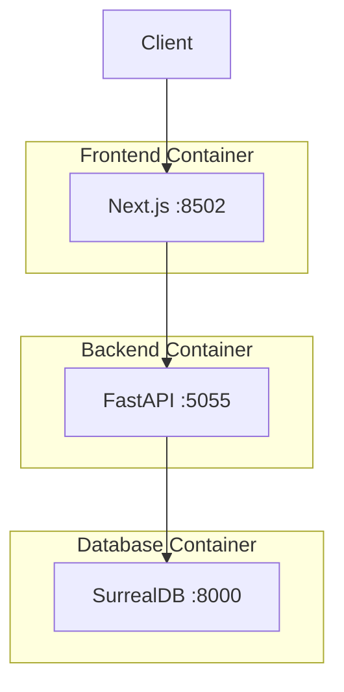

---

## 15. 总结

### 15.1 架构亮点

1. **清晰的分层架构**: Presentation → Application → Domain → Infrastructure
2. **领域驱动设计**: `ObjectModel` 基类提供统一的 CRUD 接口
3. **灵活的 AI 集成**: 通过 Esperanto 支持 16+ AI 提供商
4. **异步任务处理**: surreal-commands 处理长时间运行的任务
5. **LangGraph 工作流**: 构建复杂的 AI 交互流程
6. **双模式搜索**: 支持全文搜索和向量语义搜索

### 15.2 技术债务/改进点

1. 部分同步/异步代码混合 (如 `chat.py` 中的 `run_in_new_loop`)
2. 前端状态管理可进一步优化
3. 测试覆盖率待提升

### 15.3 扩展性

项目提供良好的扩展点：
- **Transformations**: 自定义内容转换模板
- **Commands**: 后台任务扩展
- **Prompts**: Jinja2 模板自定义
- **AI Providers**: 通过 Esperanto 添加新提供商

---

## 附录: 关键文件索引

| 文件 | 用途 |
|------|------|
| `api/main.py` | FastAPI 应用入口 |
| `api/routers/*.py` | API 路由定义 |
| `open_notebook/domain/base.py` | 基础领域模型 |
| `open_notebook/domain/notebook.py` | 核心业务模型 |
| `open_notebook/database/repository.py` | 数据库操作封装 |
| `open_notebook/graphs/*.py` | LangGraph 工作流 |
| `commands/*.py` | 后台任务命令 |
| `prompts/*.jinja` | AI 提示模板 |
| `frontend/src/lib/api/*.ts` | 前端 API 客户端 |
